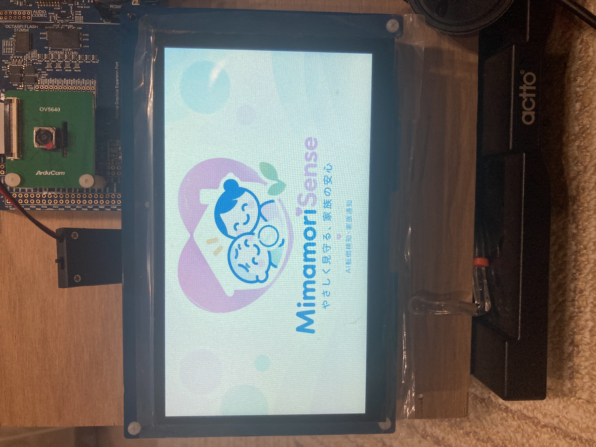

# MimamoriSense — 家庭内見守り端末

TRONプログラミングコンテスト2026 応募資料の初稿です。
Renesas EK-RA8P1を使い、カメラ画像からAIで人物を検出し、検出枠の縦横比と連続した判定結果から転倒状態を判定する見守り端末です。LCDへの結果表示、転倒状態に連動した警報、タッチ操作による日付・時刻設定を備えます。

## ハードウェア外観


## 起動画面



写真は提供された実機の表示例です。写真撮影時のファームウェアと最終提出版の対応は、提出前に確定します。

## 主な機能

| 機能 | 内容 |
|---|---|
| AI人物検出 | カメラ画像を用いた人物検出。Ethos-U55 NPU向けのモデルを使用 |
| 転倒判定 | 人物の検出枠の形状と連続フレームによる状態判定 |
| 画面表示 | カメラ映像、人物の検出枠、転倒状態、日時を表示 |
| 警報 | 転倒確定状態に応じてスピーカーから警報を出力 |
| 時刻設定 | タッチ画面から年・月・日・時・分を設定 |

CPU0ではμT-Kernel 3.0 BSP2を使用します。AIによる人物検出と、その結果を用いる転倒判定は別の処理です。処理の根拠は本ページ末尾にまとめています。

## まず読む資料

| やりたいこと | 資料 |
|---|---|
| 機材を準備し、ソースからビルドして書き込む | [セットアップ手順書](doc/submission/setup-guide.md) |
| 書き込み済みの端末を操作する | [操作マニュアル](doc/submission/operation-manual.md) |
| 審査で主要機能を確認する | [動作評価手順書](doc/submission/evaluation-guide.md) |

必要機材はEK-RA8P1、LCD拡張ボード、OV5640カメラ、スピーカー、電源・ケーブルです。時刻保持の確認にはRTCバックアップ電池も用意します。型番・接続先・開発環境は[セットアップ手順書](doc/submission/setup-guide.md)を参照してください。

## ソースコードの取得

```sh
git clone --recurse-submodules https://github.com/grace2riku/mimamori-sense.git
cd mimamori-sense
```

GitHubの「Code → Download ZIP」だけではNT-Shellサブモジュールの内容が含まれないため、上記の取得方法を使用してください。既存のcloneでは `git submodule update --init --recursive` を実行します。

| 項目 | この初稿の状態 |
|---|---|
| 文書のコード確認基準 | `c9922cf20d52afd16b2b3a1357d0d0a81f321994` |
| 最終提出タグ・コミット | 提出前に確定 |
| CPU0／CPU1の配布用ファームウェア | 提出前に配置とダウンロードURLを確定 |
| 新規環境でのビルド・書き込み手順 | 初稿。実機を使った通し確認は未実施 |

最終応募URLには、提出時点のソース・資料・対応ファームウェアを固定して案内する予定です。この初稿は提出版の動作保証や評価完了を示すものではありません。

## ソース構成

```text
e2studio/             マルチコアソリューション
e2studio_CPU0/        CPU0、μT-Kernel、AI、画面、警報のコード
e2studio_CPU1/        CPU1プロジェクト
dataset/             AIモデル関連資料・スクリプト
doc/submission/      応募用マニュアル・写真
```

## 制限事項とライセンス

転倒判定は検出枠の形状を使うため、横になった姿勢などを転倒状態として扱う場合があります。撮影条件による未検出も含め、詳しくは[操作マニュアル](doc/submission/operation-manual.md)をご確認ください。

LCD起動については暫定対策の受入記録があり、原因調査は継続しています。[セットアップ手順書](doc/submission/setup-guide.md)に最新の参照先をまとめています。

第三者のソフトウェアは、各ディレクトリ・ファイルに記載されたライセンスに従います。応募作品独自部分のライセンス表示と、配布物全体の第三者ライセンス一覧は提出前の整理事項です。

## 実装の参照先

以下は文書確認基準のコードに対する参照です。通常の操作に読む必要はありません。

- μT-Kernel起動: [hal_warmstart.c:180](e2studio_CPU0/src/hal_warmstart.c#L180)。
- AI推論・後処理から転倒判定への接続: [ai_inference_thread_entry.c:625](e2studio_CPU0/src/ai_inference_thread_entry.c#L625)、[fall_detection_logic.c:118](e2studio_CPU0/src/fall_detection_logic.c#L118)、[fall_detection_logic.c:365](e2studio_CPU0/src/fall_detection_logic.c#L365)。
- 結果表示: [fall_detection_screen.c:427](e2studio_CPU0/src/ui/fall_detection_screen.c#L427)。
- 警報要求と反映・失敗処理: [audio_alarm.c:637](e2studio_CPU0/src/audio_alarm.c#L637)、[audio_alarm.c:958](e2studio_CPU0/src/audio_alarm.c#L958)。表示だけで発音成功は判定できないため、評価では音も確認します。
- 時刻操作・完了確認の根拠: [操作マニュアルの実装参照](doc/submission/operation-manual.md)。
