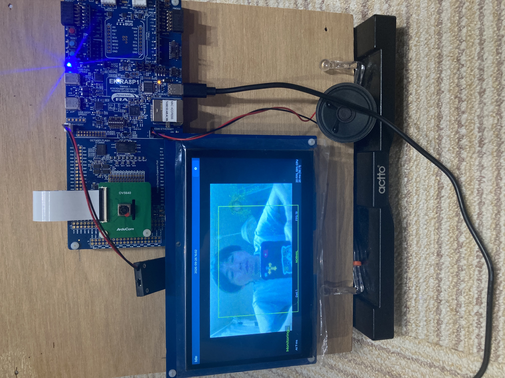
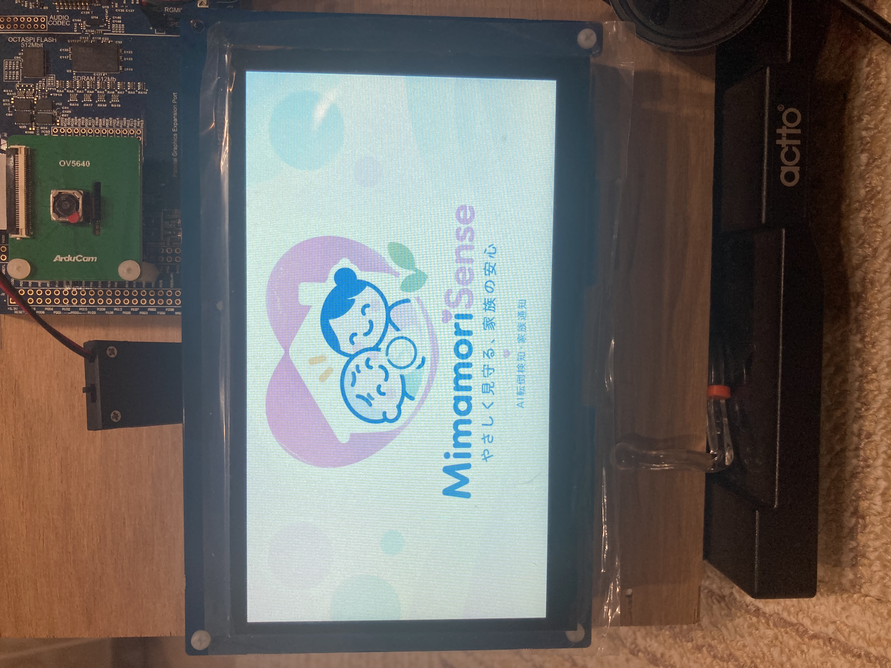

# MimamoriSense — 家庭内見守り端末

TRONプログラミングコンテスト2026 応募資料の初稿です。
Renesas EK-RA8P1を使い、カメラ画像からAIで人物を検出し、検出枠の縦横比と連続した判定結果から転倒状態を判定する見守り端末です。LCDへの結果表示、転倒状態に連動した警報、タッチ操作による日付・時刻設定を備えます。

## ハードウェア外観



## 起動画面



写真はmainブランチのファームウェアで撮影した実機の表示例です。撮影時のタグ名は `tron-programming-contest-2026`、コミットは `c9922cf20d52afd16b2b3a1357d0d0a81f321994` です。

## 主な機能

| 機能 | 内容 |
|---|---|
| AI人物検出 | カメラ画像を用いた人物検出。Ethos-U55 NPU向けのモデルを使用 |
| 転倒判定 | 人物の検出枠の形状と連続フレームによる状態判定 |
| 画面表示 | カメラ映像、人物の検出枠、転倒状態、日時を表示 |
| 警報 | 転倒確定状態に応じてスピーカーから警報を出力 |
| 時刻設定 | タッチ画面から年・月・日・時・分を設定 |

CPU0ではμT-Kernel 3.0 BSP2を使用します。AIによる人物検出と、その結果を用いる転倒判定は別の処理です。処理の根拠は本ページ末尾にまとめています。

## まず読む資料

| やりたいこと | 資料 |
|---|---|
| 機材を準備し、ソースからビルドして書き込む | [セットアップ手順書](doc/submission/setup-guide.md) |
| 書き込み済みの端末を操作する | [操作マニュアル](doc/submission/operation-manual.md) |
| 審査で主要機能を確認する | [動作評価手順書](doc/submission/evaluation-guide.md) |

必要機材はEK-RA8P1、LCD拡張ボード、OV5640カメラ、スピーカー、電源・ケーブルです。時刻保持の確認にはRTCバックアップ電池も用意します。型番・接続先・開発環境は[セットアップ手順書](doc/submission/setup-guide.md)を参照してください。

## ソースコードの取得

```sh
git clone --branch tron-programming-contest-2026 --recurse-submodules https://github.com/grace2riku/mimamori-sense.git
cd mimamori-sense
```

GitHubの「Code → Download ZIP」だけではNT-Shellサブモジュールの内容が含まれないため、上記の取得方法を使用してください。既存のcloneでは、提出タグにチェックアウトしてから `git submodule update --init --recursive` を実行します。

最終提出タグは `tron-programming-contest-2026`、コミットは `c9922cf20d52afd16b2b3a1357d0d0a81f321994` です。

## ソース構成

```text
e2studio/             マルチコアソリューション
e2studio_CPU0/        CPU0、μT-Kernel、AI、画面、警報のコード
e2studio_CPU1/        CPU1プロジェクト
dataset/             AIモデル関連資料・スクリプト
doc/submission/      応募用マニュアル・写真
```

## 制限事項

転倒判定は検出枠の形状を使うため、横になった姿勢などを転倒状態として扱う場合があります。撮影条件による未検出も含め、詳しくは[動作評価手順書「9. 評価時の制約」](doc/submission/evaluation-guide.md#9-評価時の制約)をご確認ください。

## ライセンス

リポジトリに含まれるソースコードと同梱資料で確認できるライセンス表記を以下に示します。任意機能・サンプル・参照プロジェクトも含む一覧であり、すべてが応募ファームウェアに組み込まれるという意味ではありません。各ファイルの著作権表示・ライセンス本文を参照してください。

### 主要コンポーネント・ソースファイル

| 対象 | ライセンス表記 | 適用範囲・根拠 |
|---|---|---|
| mtk3_bsp2 / μT-Kernel | T-License2.2 | `e2studio_CPU0/mtk3_bsp2`（[ライセンス案内](e2studio_CPU0/mtk3_bsp2/mtkernel/README.md)） |
| NT-Shell | MIT | `e2studio_CPU0/src/ntshell`（[取得版のライセンス](https://github.com/chiabrian/ntshell/blob/6eb15fe3476224665439a60c5dff97c41c3b2747/LICENSE.md)）。派生した [usrcmd.c](e2studio_CPU0/src/usrcmd.c#L25)・[usrcmd.h](e2studio_CPU0/src/usrcmd.h#L20) にもMIT表記あり |
| Renesas FSP・ボード関連コード・派生ソース | BSD-3-Clause | CPU0/CPU1の各ファイルで同表記のある部分。例: [bsp_api.h](e2studio_CPU0/ra/fsp/inc/api/bsp_api.h#L4)、[hal_warmstart.c](e2studio_CPU0/src/hal_warmstart.c#L4)、[blinky_thread_entry.c](e2studio_CPU1/src/blinky_thread_entry.c#L4) |
| Arm CMSIS 6 | Apache-2.0 | [CPU0のLICENSE](e2studio_CPU0/ra/arm/CMSIS_6/LICENSE)、[CPU1のLICENSE](e2studio_CPU1/ra/arm/CMSIS_6/LICENSE) |
| Arm CMSIS-DSP / CMSIS-NN / CMSIS-View | Apache-2.0 | 各ソースの表記: [arm_math.h](e2studio_CPU0/ra/arm/CMSIS-DSP/Include/arm_math.h)、[arm_nnfunctions.h](e2studio_CPU0/ra/arm/CMSIS-NN/Include/arm_nnfunctions.h)、[EventRecorder.h](e2studio_CPU0/ra/arm/CMSIS-View/EventRecorder/Include/EventRecorder.h) |
| FreeRTOS | MIT | CPU1に同梱された [FreeRTOSのLICENSE](e2studio_CPU1/ra/aws/FreeRTOS/FreeRTOS/Source/LICENSE.md) |
| LVGL | MIT | [LVGL本体のLICENCE.txt](e2studio_CPU0/ra/lvgl/lvgl/LICENCE.txt)。内部の第三者コード・フォントは後掲 |
| Arm Ethos-U core driver / core software | Apache-2.0 | CPU0のNPU関連コード（[ethosu_device.h](e2studio_CPU0/ra/npu/ethos-u-core-driver/src/ethosu_device.h)、[crc.hpp](e2studio_CPU0/ra/npu/ethos-u-core-software/lib/crc/include/crc.hpp)） |
| TensorFlow Lite Micro | Apache-2.0 | [array.h](e2studio_CPU0/ra/npu/tflite-micro/tensorflow/lite/array.h)などの各ファイルの表記 |
| FlatBuffers / gemmlowp / ruy | Apache-2.0 | [allocator.h](e2studio_CPU0/ra/npu/flatbuffers/include/flatbuffers/allocator.h)、[detect_platform.h](e2studio_CPU0/ra/npu/gemmlowp/internal/detect_platform.h)、[instrumentation.h](e2studio_CPU0/ra/npu/ruy/ruy/profiler/instrumentation.h) |
| puff | zlib形式のライセンス | `e2studio_CPU0/src/ui/puff`（[puff.hの条文](e2studio_CPU0/src/ui/puff/puff.h#L1)） |
| 応募作品独自部分 | MIT | 第三者由来のコード・素材を除く応募作品独自部分。第三者部分には各々のライセンス表記が適用されます |

### LVGL内の第三者コード・同梱ライセンス

LVGLの[第三者コード一覧](e2studio_CPU0/ra/lvgl/lvgl/COPYRIGHTS.md)と各ファイルに基づきます。

| 対象 | ライセンス表記 | 根拠 |
|---|---|---|
| Barcode / code128 | BSD-2-Clause | [LICENSE.txt](e2studio_CPU0/ra/lvgl/lvgl/src/libs/barcode/LICENSE.txt) |
| Expat | MIT | [LICENSE.txt](e2studio_CPU0/ra/lvgl/lvgl/src/libs/expat/LICENSE.txt) |
| FreeType連携 | FreeType Project License（FTL） | [同梱LICENSE.txt](e2studio_CPU0/ra/lvgl/lvgl/src/libs/freetype/LICENSE.txt)。LVGLにはインターフェースのみが含まれ、FreeType本体は含まれません |
| GIF decoder / gifdec | Public Domain | [LICENSE.txt](e2studio_CPU0/ra/lvgl/lvgl/src/libs/gif/LICENSE.txt) |
| LodePNG | zlib | [LICENSE.txt](e2studio_CPU0/ra/lvgl/lvgl/src/libs/lodepng/LICENSE.txt) |
| LZ4 | BSD-2-Clause | [LICENSE.txt](e2studio_CPU0/ra/lvgl/lvgl/src/libs/lz4/LICENSE.txt) |
| QR Code generator | MIT | [LICENSE.txt](e2studio_CPU0/ra/lvgl/lvgl/src/libs/qrcode/LICENSE.txt) |
| ThorVG | MIT | [LICENSE.txt](e2studio_CPU0/ra/lvgl/lvgl/src/libs/thorvg/LICENSE.txt) |
| RapidJSON（ThorVG内） | MIT | [rapidjson.h](e2studio_CPU0/ra/lvgl/lvgl/src/libs/thorvg/rapidjson/rapidjson.h#L1) |
| TinyTTF / stb由来部分 | stb部分はMITまたはPublic Domain（Unlicense）、改変部分はMIT | [LICENSE.txt](e2studio_CPU0/ra/lvgl/lvgl/src/libs/tiny_ttf/LICENSE.txt) |
| TJPGD | ChaN独自ライセンス（著作権表示の保持） | [LICENSE.txt](e2studio_CPU0/ra/lvgl/lvgl/src/libs/tjpgd/LICENSE.txt) |
| TLSF | BSD-3-Clause | [lv_tlsf.hの条文](e2studio_CPU0/ra/lvgl/lvgl/src/stdlib/builtin/lv_tlsf.h#L8) |
| printf | MIT | [LICENSE_SPRINTF.txt](e2studio_CPU0/ra/lvgl/lvgl/src/stdlib/builtin/LICENSE_SPRINTF.txt) |
| lv_math.c内の借用コード | MIT | [lv_math.cの表記](e2studio_CPU0/ra/lvgl/lvgl/src/misc/lv_math.c#L85) |

### LVGLのフォント関連資料

| 対象 | ライセンス表記 | 根拠 |
|---|---|---|
| DejaVu Sans | Bitstream Vera・Arevのフォントライセンス、DejaVu変更分はPublic Domain | [LICENSE](e2studio_CPU0/ra/lvgl/lvgl/scripts/built_in_font/font_license/DejaVuSans/LICENSE) |
| Font Awesome 5 | フォント: SIL OFL-1.1、アイコン: CC BY-4.0、コード: MIT | [形式ごとの適用範囲](e2studio_CPU0/ra/lvgl/lvgl/scripts/built_in_font/font_license/FontAwesome5/LICENSE.txt) |
| Montserrat | SIL OFL-1.1 | [OFL.txt](e2studio_CPU0/ra/lvgl/lvgl/scripts/built_in_font/font_license/Montserrat/OFL.txt) |
| Source Han Sans SC | SIL OFL-1.1 | [LICENSE.txt](e2studio_CPU0/ra/lvgl/lvgl/scripts/built_in_font/font_license/SourceHanSansSC/LICENSE.txt) |
| Unscii | 通常のバリアントはPublic Domain、unscii-16-fullはGPL | [同梱説明](e2studio_CPU0/ra/lvgl/lvgl/scripts/built_in_font/font_license/unscii/unscii.html)。バリアントによって表記が異なります |
| FreeTypeサンプルのフォント | SIL OFL-1.1 | [サンプルのOFL.txt](e2studio_CPU0/ra/lvgl/lvgl/examples/libs/freetype/OFL.txt) |

### 個別条件のあるソース・参照プロジェクト

| 対象 | 確認した表記 | 根拠・適用範囲 |
|---|---|---|
| MERA生成モデルのソース | Apache-2.0表記に加え、Renesas由来部分にRenesas製品用途の条件あり | [model_net1.cの冒頭](e2studio_CPU0/src/ai_application/fall_detection/mera/model_net1.c#L1)など。同ディレクトリの全ファイルを一律にApache-2.0とは扱わず、各ファイルの表記を参照してください |
| D/AVE 2Dの個別表記ファイル | Renesasの著作権・免責事項と「Purpose: only for testing」の記載（OSSライセンス名の記載なし） | [dave_64bitoperation.c](e2studio_CPU0/ra/tes/dave2d/src/dave_64bitoperation.c#L1) |
| RUHMI Framework参照プロジェクト | フレームワークはApache-2.0。生成コードは各ファイルの表示を参照 | [LICENSE.md](reference_projects/ruhmi-framework-mcu/LICENSE.md)。同梱サンプルのFSP・CMSIS・FreeRTOSにもそれぞれBSD-3-Clause・Apache-2.0・MITの表記があります |

RUHMIのホスト環境へのインストール時に取得する外部コンポーネントは、同資料の[External Licenses](reference_projects/ruhmi-framework-mcu/LICENSE.md#external-licenses)に別途列挙されています。また、上記のソースコードのライセンス表記から、学習データやモデル重みの利用条件まで一律に判断するものではありません。

## 実装の参照先

以下は文書確認基準のコードに対する参照です。通常の操作に読む必要はありません。

- μT-Kernel起動: [hal_warmstart.c:180](e2studio_CPU0/src/hal_warmstart.c#L180)。
- AI推論・後処理から転倒判定への接続: [ai_inference_thread_entry.c:625](e2studio_CPU0/src/ai_inference_thread_entry.c#L625)、[fall_detection_logic.c:118](e2studio_CPU0/src/fall_detection_logic.c#L118)、[fall_detection_logic.c:365](e2studio_CPU0/src/fall_detection_logic.c#L365)。
- 結果表示: [fall_detection_screen.c:427](e2studio_CPU0/src/ui/fall_detection_screen.c#L427)。
- 警報要求と反映・失敗処理: [audio_alarm.c:637](e2studio_CPU0/src/audio_alarm.c#L637)、[audio_alarm.c:958](e2studio_CPU0/src/audio_alarm.c#L958)。表示だけで発音成功は判定できないため、評価では音も確認します。
- 時刻操作・完了確認の根拠: [操作マニュアルの実装参照](doc/submission/operation-manual.md)。
