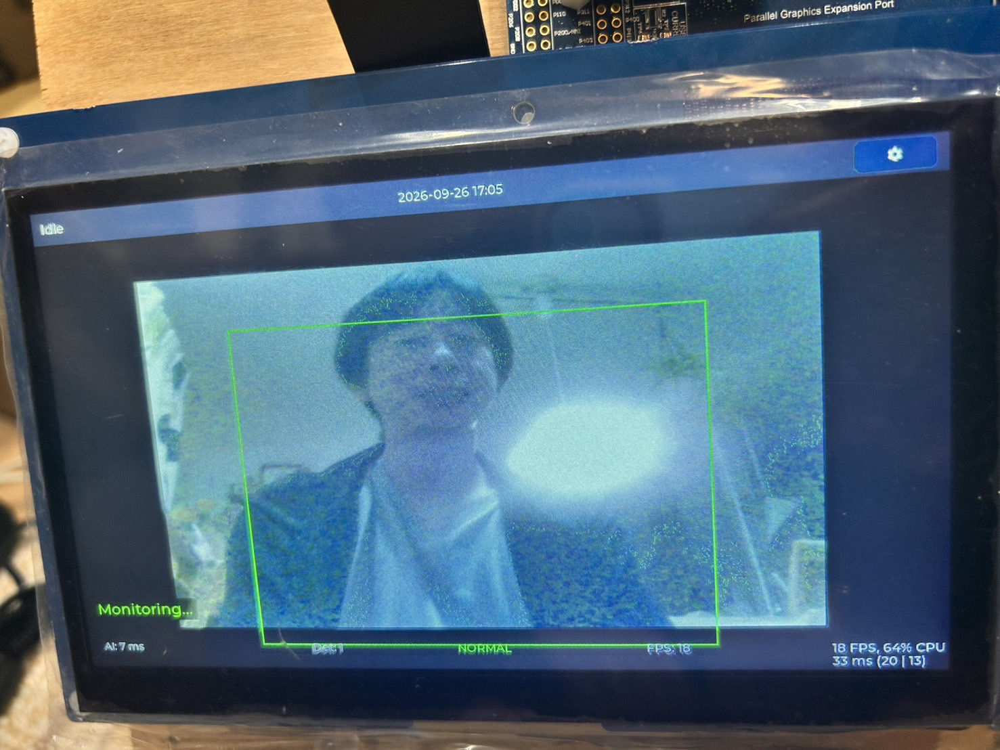
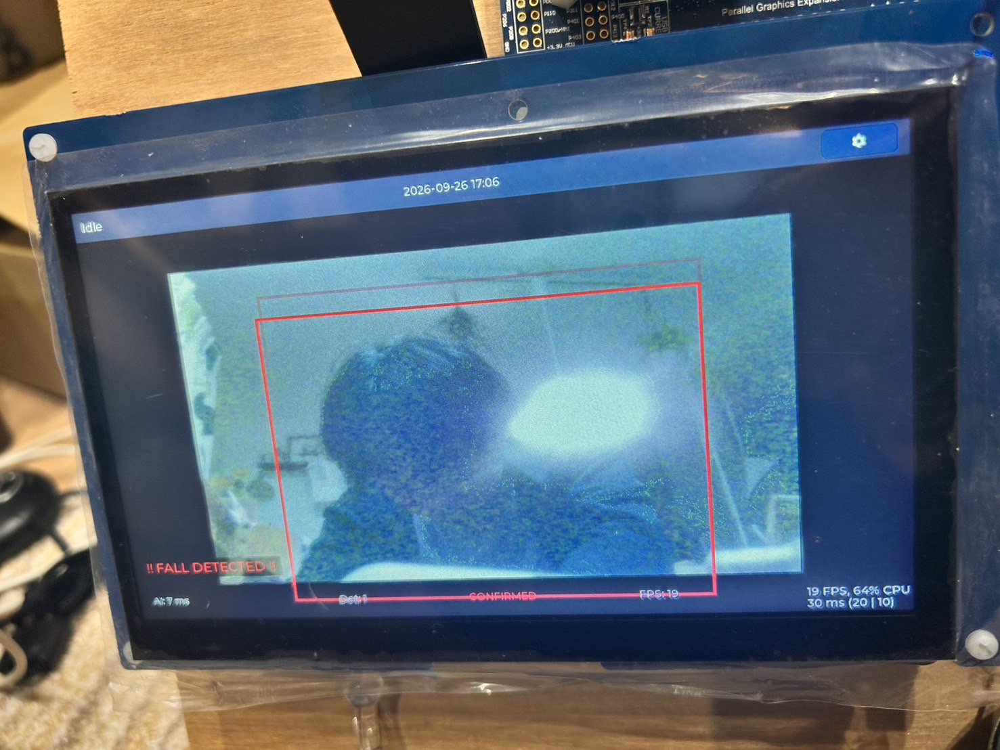
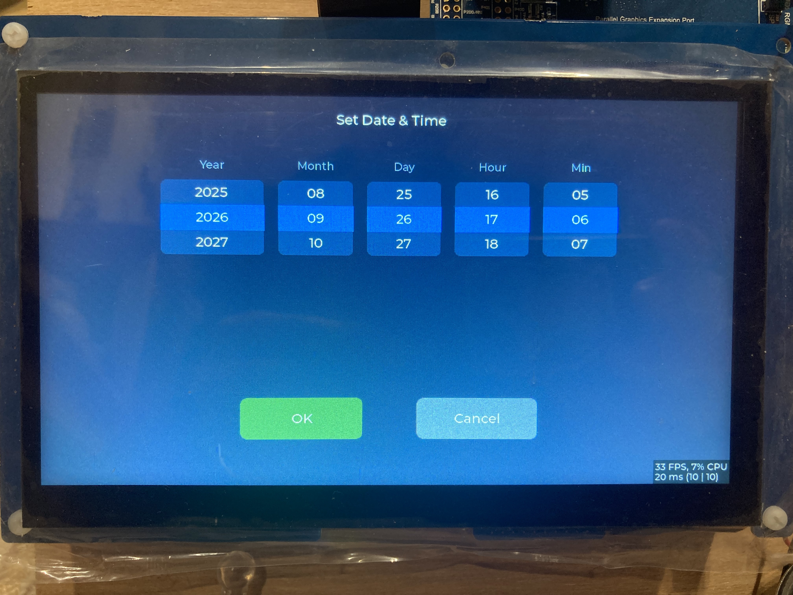

# mimamori-sense 操作マニュアル

[READMEへ戻る](../../README.md) · [セットアップ手順書](setup-guide.md) · [動作評価手順書](evaluation-guide.md)

## 1. 使用前の準備

本書は、ファームウェアの書き込みと機材の接続が済んだ端末を操作するための説明です。初めて使用する場合は、先に[セットアップ手順書](setup-guide.md)を参照してください。

本書の画面写真はmainブランチのファームウェアで撮影した実機写真です（撮影者確認）。本文の操作・表示仕様はリポジトリのソースコードに基づいて記載しています。撮影時の正確なコミットと最終提出版の対応、および提出版での動作は、提出前に確認してください。

## 2. 本体各部

| 部位 | 用途 |
|---|---|
| LCD・タッチパネル | カメラ映像、転倒検出状態、日時の表示と日時設定 |
| カメラ | 人物の撮影 |
| スピーカー | 転倒確定時の警報音出力 |
| RTCバックアップ電池 | 主電源を切っている間の時計用電源 |

接続先と電源の条件は[セットアップ手順書](setup-guide.md)を参照してください。

## 3. 電源投入と起動

1. 接続を確認し、セットアップ手順書に従って給電します。
2. 起動画面の表示を待ちます。
3. 起動画面の描画後、約5秒でメイン画面に切り替わります。開始ボタンを押す操作はありません。[根拠A](#付録操作仕様の根拠)
4. カメラ映像が更新されることを確認します。初回使用時など、日時が `--:--` の場合は「7. 日付・時刻の変更」で設定します。

画面が全面白のままの場合は「9. 困ったとき」を参照してください。起動画面の生成に失敗した場合は、直接メイン画面を表示する実装です。[根拠A](#付録操作仕様の根拠)

## 4. メイン画面の見方

| 表示 | 読み方 |
|---|---|
| カメラ映像と人物の枠 | 検出した人物の位置。枠の色は端末全体の転倒判定状態を表します |
| `Monitoring...` / `Fall Suspected` / `!! FALL DETECTED !!` | 監視中／転倒の疑い／転倒確定 |
| `NORMAL` / `SUSPECTED` / `CONFIRMED` | 上記に対応する判定状態 |
| `Det: 数値` | 現在の検出数。過去の転倒回数ではありません |
| `AI: 数値 ms` | AI推論処理時間 |
| `FPS: 数値` | カメラ表示の更新頻度 |
| 上部中央の日時 | `年-月-日 時:分`。有効な日時が取得できない場合は `--:--` |
| 右上の歯車ボタン | 日付・時刻設定画面を開きます |

画面上部の `Idle` は転倒判定を示す表示ではありません。判定は `Monitoring...` などの文字と `NORMAL` などの状態表示で確認してください。[根拠B・C](#付録操作仕様の根拠)

## 5. 転倒を検出していないとき

通常の監視状態では `Monitoring...` と `NORMAL` を表示します。人物を検出している場合、枠は緑色です。転倒候補が続くと、一時的に黄色の枠と `Fall Suspected` / `SUSPECTED` の表示になります。[根拠B・D](#付録操作仕様の根拠)

人物が写っていない状態も、転倒確定前は `NORMAL` になり得ます。表示だけで撮影状態を判断せず、カメラ映像と人物の枠も確認してください。

## 6. 転倒を検出したときと復帰

転倒候補が連続して検出されると、赤色の枠と `!! FALL DETECTED !!` / `CONFIRMED` を表示し、警報音を出力します。画面表示と音の両方を確認してください。現在の既定設定では5回連続の判定で転倒確定となるため、固定の秒数で確定する仕様ではありません。[根拠B・D・E](#付録操作仕様の根拠)

復帰を確認するには、カメラの前で上体を起こして人物の検出枠が表示される状態を保ち、`Monitoring...` / `NORMAL` に戻ることと、警報音が止まることを確認します。現在の既定設定では、人物を有効に検出し、転倒候補がない判定が5回連続すると復帰します。**人物が画面外へ出ただけでは転倒確定は解除されません。** [根拠D・E](#付録操作仕様の根拠)

タッチ画面に警報停止・消音ボタンはありません。検出の確認方法は[動作評価手順書](evaluation-guide.md)を参照してください。

## 7. 日付・時刻の変更

1. メイン画面右上の歯車ボタンをタッチします。
2. `Set Date & Time` 画面で各列を上下に動かし、中央の選択値を合わせます。
   - `Year`：年（2000〜2099年）
   - `Month`：月
   - `Day`：日（選んだ年月に応じた日数）
   - `Hour`：時（24時間表示）
   - `Min`：分
3. 変更する場合は `OK` をタッチします。秒は0秒に設定されます。
4. `Setting...` の表示中は完了を待ちます。設定と読み戻しが成功すると、メイン画面に戻ります。上部の日時を確認してください。
5. `OK` を押す前に変更を取りやめる場合は `Cancel` をタッチします。[根拠C・F](#付録操作仕様の根拠)

### 設定結果が表示された場合

| メッセージ | 意味と対応 |
|---|---|
| `Current time unavailable; choose date/time` | 現在時刻を取得できません。正しい日時を選択して設定します |
| `Time service unavailable or busy` | 要求を受け付けられませんでした。少し待ってから再操作します |
| `Result unconfirmed; Back does not cancel` | 約3秒以内に結果を確認できませんでした。`Back` で画面を戻しても設定要求は取り消されません。結果確認が済むまでは再設定できません |
| `Time set; readback unavailable` | 書き込みは成功しましたが、読み戻しを確認できません。メイン画面の日時を確認してください |
| `RTC not initialized` / `RTC access failed` | 時計の初期化またはアクセスの問題です。接続・設定をセットアップ手順書と照合してください |
| `RTC busy - try again` | 時計が使用中です。少し待って再操作してください |

電源を切った後の時計保持を確認する場合は、バックアップ電池を接続し、[動作評価手順書](evaluation-guide.md)に従って再投入後の日時を確認してください。

## 8. 使用終了

日時設定の処理中は結果を確認してから終了してください。端末への主電源の給電を停止します。バックアップ電池の接続・取り外し方法は[セットアップ手順書](setup-guide.md)を参照してください。

## 9. 困ったとき

| 症状 | 確認すること |
|---|---|
| LCDが全面白になる | [白画面不具合の調査記録](../design/white-screen-boot-regression.md)とセットアップ手順書を参照。ACアダプタへの変更だけで解消するとは判断しないでください |
| カメラ映像が出ない・更新されない | 電源を切ってカメラの接続を照合し、セットアップ手順書の起動確認からやり直します |
| 人物に枠が付かない | 人物が画面に入る向き・距離に調整し、動作評価手順書の撮影条件を確認します |
| 転倒表示が残る | 人物が画面外にいないか確認し、上体を起こして人物の検出枠が表示される姿勢で復帰を確認します |
| 転倒確定しても音が出ない | スピーカーの接続・電源をセットアップ手順書と照合します。表示の成功だけで音の動作確認を完了しないでください |
| 日時が `--:--` になる | 日時未設定だけでなく取得失敗でも表示されます。日時設定画面のメッセージを確認します |

## 付録：操作仕様の根拠

以下は文書の保守・審査時の照合用です。通常の操作では読む必要はありません。行番号は本書作成時点のソースに対応します。

| 根拠 | 確認したコード |
|---|---|
| A 起動と画面遷移 | [lvgl_thread_entry.c:209](../../e2studio_CPU0/src/lvgl_thread_entry.c#L209)〜288（画面と表示処理の初期化、起動画面失敗時の扱い）、[ui_startup_screen.c:29](../../e2studio_CPU0/src/ui/ui_startup_screen.c#L29)〜115（初回描画、5秒タイマ、復帰） |
| B 転倒表示 | [fall_detection_screen.c:427](../../e2studio_CPU0/src/ui/fall_detection_screen.c#L427)〜606（枠・状態・統計表示）、[fall_detection_screen.h:63](../../e2studio_CPU0/src/ui/fall_detection_screen.h#L63)〜73（色）、[camera_display.c:398](../../e2studio_CPU0/src/camera_display.c#L398)〜454（推論通知と表示更新） |
| C 上部表示と設定入口 | [ui_main_screen.c:318](../../e2studio_CPU0/src/ui/ui_main_screen.c#L318)〜381・449〜456、[ui_datetime.c:125](../../e2studio_CPU0/src/ui/ui_datetime.c#L125)〜179（日時・取得不能時の表示） |
| D 転倒確定・復帰条件 | [ai_inference_thread_entry.c:543](../../e2studio_CPU0/src/ai_inference_thread_entry.c#L543)〜685（初期化と推論後の判定）、[fall_detection_logic.c:118](../../e2studio_CPU0/src/fall_detection_logic.c#L118)〜195・365〜438（状態遷移と有効な非転倒観測）、[fall_detection_logic.h:62](../../e2studio_CPU0/src/fall_detection_logic.h#L62)〜82（既定値） |
| E 自動警報 | [audio_alarm.c:637](../../e2studio_CPU0/src/audio_alarm.c#L637)〜660（確定・復帰と要求の対応）、同ファイル739〜1013・1570〜1593（再生、失敗の処理・再試行）、[audio_port.c:1425](../../e2studio_CPU0/src/port/audio_port.c#L1425)〜1596（音声開始・停止） |
| F 日時の編集と保存 | [ui_time_setting_screen.c:163](../../e2studio_CPU0/src/ui/ui_time_setting_screen.c#L163)〜212・250〜290・662〜818（選択、要求発行、Cancel/Back、結果確認）、[time_cache.c:320](../../e2studio_CPU0/src/time_cache.c#L320)〜358（書き込みと読み戻しの結果通知）、[time_ctrl.c:316](../../e2studio_CPU0/src/time_ctrl.c#L316)〜364（RTC書き込みと戻り値） |
