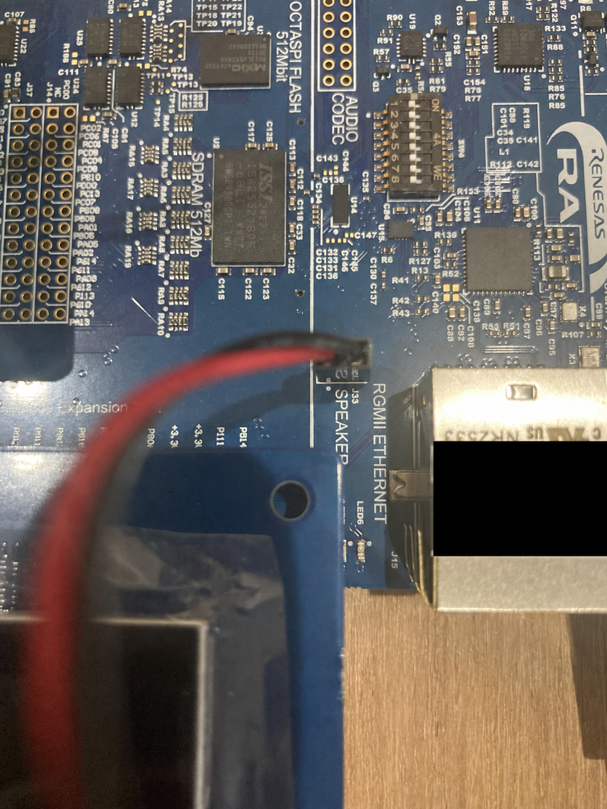

# セットアップ手順書

[READMEへ戻る](../../README.md) · [操作マニュアル](operation-manual.md) · [動作評価手順書](evaluation-guide.md)

本書は、mimamori-sense の機材を準備し、ソースコードを取得してビルド・書き込みするための手順です。ファームウェア書き込み済みの機材を受け取った場合は、2〜4節の接続を確認し、8節へ進んでください。

## 1. 準備の流れ

1. 必要な機材をそろえ、電源を外した状態で接続する。
2. ソースコードと開発環境を準備する。
3. CPU1・CPU0のプロジェクトをビルドする。
4. 両コアのファームウェアを書き込む。
5. ACアダプタ給電に切り替えて起動し、画面・カメラ・音・時刻を確認する。

## 2. 必要な機材

| 機材 | 数量 | 用途・条件 |
|---|---:|---|
| Renesas EK-RA8P1 評価キット | 1 | 本体。RA8P1のCPU0／CPU1を使用 |
| パラレルグラフィクス拡張ボード・タッチLCD | 1式 | EK-RA8P1用、1024×600の表示構成 |
| MIPIカメラ拡張ボード | 1式 | OV5640センサーを使用する構成。汎用USBカメラへの置換は対象外 |
| スピーカー・接続線 | 1式 | 50mmΦ、8Ω、0.4Wのダイナミックスピーカー。型番・購入先は3.2節を参照。J33に接続 |
| RTCバックアップ用CR2032電池・ホルダー | 1式 | 3.0V。主電源を切った後の時刻保持の確認に使用。ホルダーと配線の詳細は3.3節を参照 |
| 5V ACアダプタ・給電ケーブル | 1式 | 表示・動作確認用。既存の確認では5.1V・3.8Aのアダプタを使用。必要電流の下限は未測定 |
| Windows PC | 1 | ソースの取得、ビルド、書き込みに使用 |
| USBデータ通信ケーブル | 1 | PCとEK-RA8P1のJ10を接続する書き込み用ケーブル |

審査時に提供する機材と、審査側で用意する機材の区分は提出前に確定します。


## 3. ハードウェアの接続

### 3.1 LCD・カメラ

1. PC接続・ACアダプタを外し、本体が無給電であることを確認する。
2. EK-RA8P1用のLCD・カメラ拡張ボードを、キットのユーザーズマニュアルに従って装着する。
3. コネクタのずれ、ケーブルの浮き、金属部の接触がないことを確認する。

写真は組み立て例です。コネクタ番号・向きが読み取れない箇所を写真だけで判断しないでください。部品の詳細型番と接続箇所を示す図は提出前の確認項目です。

### 3.2 スピーカー

使用部品は **ダイナミックスピーカー 50mmΦ・8Ω・0.4W** です。購入先は[秋月電子通商（販売コード109013、型番WAY50-1-8F32P-01）](https://akizukidenshi.com/catalog/g/g109013/)です。使用部品は製作者の回答、仕様と型番は商品ページで確認しています。




1. スピーカーをJ33のスピーカー出力に接続する。J33 1ピン（●印）にスピーカープラス（赤の信号線）、2ピンにスピーカーマイナス（黒の信号線）を接続します。
2. J41の3–4が短絡されていることを確認する。

### 3.3 RTCバックアップ電池


使用電池は **CR2032（3.0V）** です。100円ショップで購入できるCR2032を使用しました。

電池ホルダーのケーブルを基板上の **J36（BATTERY）** に接続します。
設定後の時刻保持は[動作評価手順書](evaluation-guide.md)で確認します。

## 4. 給電方法

- **書き込み時**: J10とPCをUSBデータ通信ケーブルで接続する。
- **表示・動作確認時**: デバッグを終了し、PCのケーブルを外して、J10へ5V ACアダプタから給電する。

J10はデバッグ・コンソールにも使用するため、ACアダプタを接続している間は同じ端子でPCへ接続できません。

## 5. ソースコードと開発環境の準備

### 5.1 ソースコードの取得

GitをインストールしたPCで次を実行します。

```powershell
git clone --recurse-submodules https://github.com/grace2riku/mimamori-sense.git
cd mimamori-sense
git submodule update --init --recursive
git rev-parse HEAD
git submodule status --recursive
```

確認時の実行結果は次のとおりです。

```text
> git rev-parse HEAD
c9922cf20d52afd16b2b3a1357d0d0a81f321994

> git submodule status --recursive
6eb15fe3476224665439a60c5dff97c41c3b2747 e2studio_CPU0/src/ntshell (heads/master)
```

提出版のタグ・コミットは[README](../../README.md)に記載する予定です。提出版が確定した後は、その版にチェックアウトしてからサブモジュールを更新します。

GitHubの「Download ZIP」だけではNT-Shellのサブモジュールを取得できません。Gitでの取得を使用してください。NT-Shellの取得先は[.gitmodules](../../.gitmodules#L1)で指定されています。

### 5.2 開発環境

| 項目 | 使用する版・内容 |
|---|---|
| IDE | e2 studio 2025-12（25.12.0） |
| Renesas FSP | 6.3.0、EK-RA8P1対応パッケージ |
| コンパイラ | LLVM Embedded Toolchain for Arm 21.1.1 |
| デバッグ | EK-RA8P1のJ-Link接続を使うe2 studioのデバッグ環境 |
| ビルド構成 | Debug |

e2 studio・FSPはRenesasの配布環境から上記の版を導入し、LLVM 21.1.1を選択できることを確認します。

### 5.3 同梱されているもの

- CPU0／CPU1のユーザーソース、FSP設定、`ra`・`ra_cfg`・`ra_gen`配下のコード。
- CPU0用μT-Kernel 3.0 BSP2のソース（`e2studio_CPU0/mtk3_bsp2`）。
- LVGLなどのプロジェクト内依存ソース。
- AIモデルの変換済みCコード・重み・NPUコマンド列（`e2studio_CPU0/src/ai_application/fall_detection/mera`）。
- モデル変換元のTFLiteファイル（`dataset/models`）。

通常の端末用ファームウェアのビルドでは、同梱の変換済みモデルを使用します。学習データのダウンロード、再学習、RUHMIでのモデル再変換は本手順には含めません。

`Debug`配下の生成物、書き込み用ELF/MOTはGit管理していません。

## 6. プロジェクトの読み込みとビルド

以下は既存プロジェクトの設定に基づく手順案です。初回のクリーン環境での実行確認が必要です。

1. e2 studioで新しいワークスペースを開く。
2. `File > Import > General > Existing Projects into Workspace`で、取得したリポジトリを指定する。
3. 次の3プロジェクトを読み込む。元の相対配置を維持するため、別々の場所へコピーしない。

   | ディレクトリ | e2 studio内のプロジェクト名 |
   |---|---|
   | `e2studio` | `mimamori_sense` |
   | `e2studio_CPU0` | `mimamori_sense_CPU0` |
   | `e2studio_CPU1` | `mimamori_sense_CPU1` |

4. プロジェクト > すべてをビルド を選択する。
5. CPU0、CPU1でエラーがないことを確認する。
6. 次のELFが生成されていることを確認する。

```text
e2studio_CPU1/Debug/mimamori_sense_CPU1.elf
e2studio_CPU0/Debug/mimamori_sense_CPU0.elf
```

## 7. ファームウェアの書き込み

1. アプリケーションノート『RA8デュアルコアMCUを用いたアプリケーション開発 R01AN7881JJ0110』を参照し、プロジェクトのダウンロード・実行の設定を行う。
2. PCとJ10をUSBケーブルで接続する（J10側はUSBタイプC）。
3. 書き込みを実行する。
4. デバッグを終了し、PCからUSBケーブルを外す。以降の動作確認はACアダプタ給電で確認する。

## 8. 初回起動

1. ハードウェアの接続を確認して、J10へACアダプタから給電する。
2. 起動画面、その後のメイン画面とカメラ映像を確認する。
3. [操作マニュアル](operation-manual.md)に従って日付・時刻を設定する。
4. [動作評価手順書](evaluation-guide.md)に従って、未転倒表示・転倒表示・警報音を確認する。

## 9. うまく動かない場合

| 症状 | 確認すること |
|---|---|
| NT-Shellのソースがない | `git submodule update --init --recursive`の完了を確認 |
| `bsp_linker_info.h`、`memory_regions.lld`などがない | Debug構成、3プロジェクトの読み込み、FSP生成結果を確認 |
| コンパイラが見つからない | LLVM 21.1.1の導入・e2 studioのツールチェイン登録を確認 |
| J-Linkに接続できない | USBデータ通信対応ケーブル、J10、デバッグ接続設定を確認 |
| カメラ映像が出ない | 電源を外してカメラ基板・接続を確認。UIが出る場合もカメラ正常とは判定しない |
| 警報音が出ない | J33のスピーカー接続とJ41 3–4の短絡を確認 |
| 電源を切ると時刻が保持されない | バックアップ電池・接続・設定した時刻を確認 |
