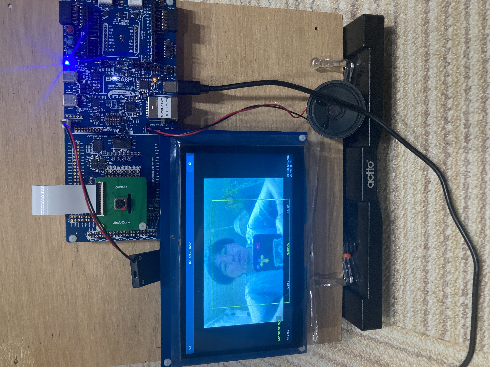
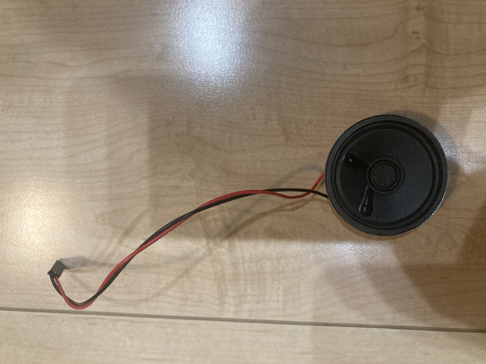
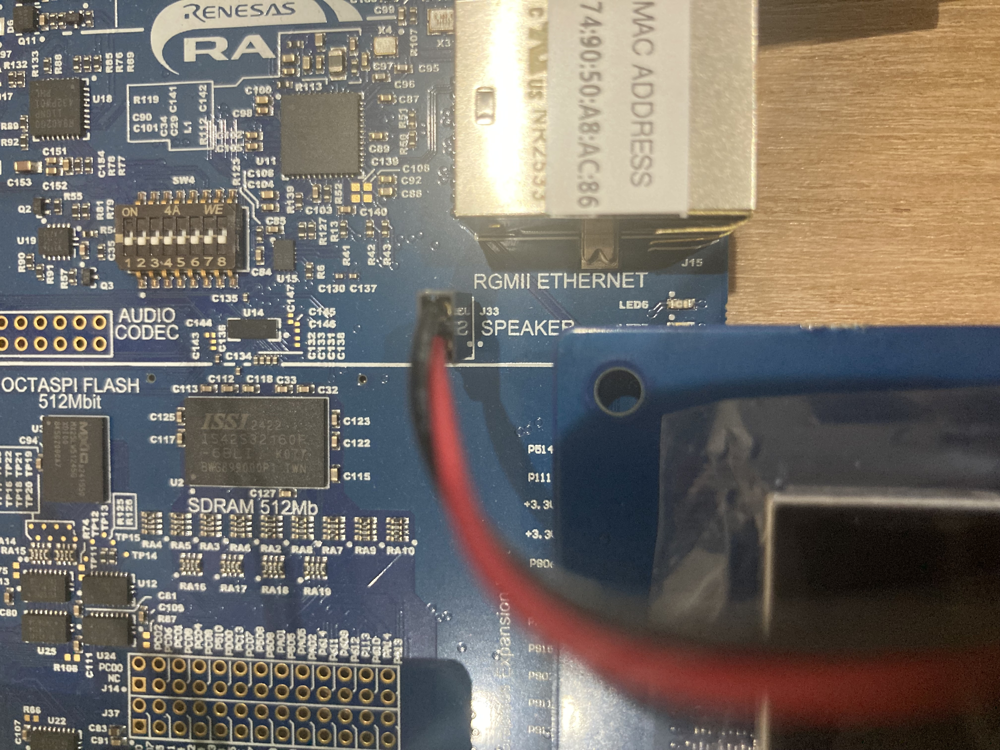
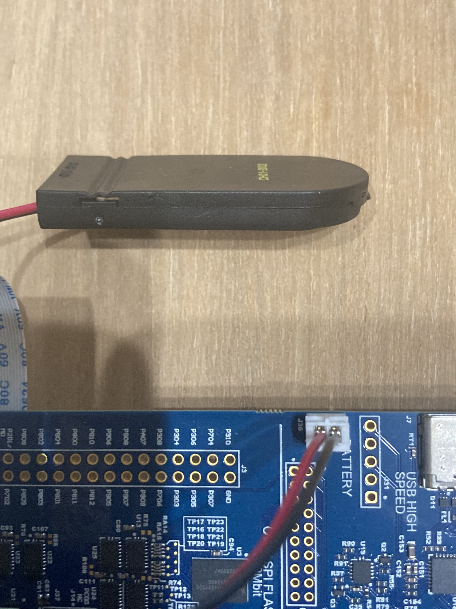

# セットアップ手順書

[READMEへ戻る](../../README.md) · [操作マニュアル](operation-manual.md) · [動作評価手順書](evaluation-guide.md)

本書は、mimamori-sense の機材を準備し、ソースコードを取得してビルド・書き込みするための手順です。ファームウェア書き込み済みの機材を受け取った場合は、2〜4節の接続を確認し、8節へ進んでください。

> **初稿の確認範囲**: リポジトリの設定・ソース・既存の実測記録を照合して作成しました。本書どおりの新規PCでのビルド・書き込みは未検証です。提出対象のタグ、書き込み済み機材の提供範囲、部品の詳細型番、CPU1を含む書き込み設定は提出前に確定します。未確定項目は末尾にまとめています。

## 1. 準備の流れ

1. 必要な機材をそろえ、電源を外した状態で接続する。
2. ソースコードと開発環境を準備する。
3. CPU1・CPU0のプロジェクトをビルドする。
4. 両コアのファームウェアを書き込む。
5. ACアダプタ給電に切り替えて起動し、画面・カメラ・音・時刻を確認する。

## 2. 必要な機材

| 機材 | 数量 | 用途・条件 |
|---|---:|---|
| Renesas EK-RA8P1 評価キット | 1 | 本体。RA8P1のCPU0／CPU1を使用 |
| パラレルグラフィクス拡張ボード・タッチLCD | 1式 | EK-RA8P1用、1024×600の表示構成 |
| MIPIカメラ拡張ボード | 1式 | OV5640センサーを使用する構成。汎用USBカメラへの置換は対象外 |
| スピーカー・接続線 | 1式 | ボードのJ33に接続。型番・インピーダンス・定格は提出前に追記 |
| RTCバックアップ用3.0Vコイン電池・ホルダー | 1式 | 主電源を切った後の時刻保持の確認に使用。型番・配線詳細は提出前に追記 |
| 5V ACアダプタ・給電ケーブル | 1式 | 表示・動作確認用。既存の確認では5.1V・3.8Aのアダプタを使用。必要電流の下限は未測定 |
| Windows PC | 1 | ソースの取得、ビルド、書き込みに使用 |
| USBデータ通信ケーブル | 1 | PCとEK-RA8P1のJ10を接続する書き込み用ケーブル |

審査時に提供する機材と、審査側で用意する機材の区分は提出前に確定します。



## 3. ハードウェアの接続

### 3.1 LCD・カメラ

1. PC接続・ACアダプタを外し、本体が無給電であることを確認する。
2. EK-RA8P1用のLCD・カメラ拡張ボードを、キットのユーザーズマニュアルに従って装着する。
3. コネクタのずれ、ケーブルの浮き、金属部の接触がないことを確認する。

写真は組み立て例です。コネクタ番号・向きが読み取れない箇所を写真だけで判断しないでください。部品の詳細型番と接続箇所を示す図は提出前の確認項目です。

### 3.2 スピーカー





1. スピーカーをJ33のスピーカー出力に接続する。既存の接続資料ではJ33-1がSP_P、J33-2がSP_Nです。
2. **J41の3–4が短絡されていることを確認する。** 過去の資料には「初期状態で短絡済み」とありますが、実機で開放だったことが確認されています。出荷状態を前提にせず目視確認してください。

接続先とJ41の訂正は[音声出力の設定資料](../fsp-setup-guide/issue-45-audio-output-modules.md#L3)を参照してください。スピーカーの定格は写真から推定せず、使用部品を確定してから記載します。

### 3.3 RTCバックアップ電池



提供写真では、電池ホルダーのケーブルを基板上の **J36（BATTERY）** に接続しています。RTCのバックアップには3.0Vコイン電池を使用した既存の実機記録があります。電池・ホルダーの型番とピンごとの極性は提出前に確定します。写真ではコネクタで隠れたピンの極性を確定できないため、接続済みの機材では写真の配線を維持し、新規組み立て時は使用キットの端子仕様と照合してください。

設定後の時刻保持は[動作評価手順書](evaluation-guide.md)で確認します。既存のハードウェア確認記録は[RTC設定資料のVBATT項目](../fsp-setup-guide/issue-211-rtc.md#L87)にあります。

## 4. 給電方法

- **書き込み時**: J10とPCをUSBデータ通信ケーブルで接続する。
- **表示・動作確認時**: デバッグを終了し、PCのケーブルを外して、J10へ5V ACアダプタから給電する。

J10はデバッグ・コンソールにも使用するため、ACアダプタを接続している間は同じ端子でPCへ接続できません。J60を併用する給電構成は本書の標準手順に含めません。

ACアダプタを使う目的は、比較条件をそろえるためです。白画面を必ず防止するという意味ではありません。電源条件の根拠は[給電の記録](../hardware-setup-guide/power-supply.md#L30)、白画面の最新の受入結果は[Issue #230設計記録32節](../design/issue-230.md#L1043)を参照してください。

## 5. ソースコードと開発環境の準備

### 5.1 ソースコードの取得

GitをインストールしたPCで次を実行します。

```powershell
git clone --recurse-submodules https://github.com/grace2riku/mimamori-sense.git
cd mimamori-sense
git submodule update --init --recursive
git rev-parse HEAD
git submodule status --recursive
```

最後の2コマンドの結果を控えてください。提出版のタグ・コミットは[README](../../README.md)に記載する予定です。提出版が確定した後は、その版にチェックアウトしてからサブモジュールを更新します。

GitHubの「Download ZIP」だけではNT-Shellのサブモジュールを取得できません。Gitでの取得を使用してください。NT-Shellの取得先は[.gitmodules](../../.gitmodules#L1)で指定されています。

### 5.2 開発環境

| 項目 | 使用する版・内容 |
|---|---|
| IDE | e2 studio 2025-12（25.12.0） |
| Renesas FSP | 6.3.0、EK-RA8P1対応パッケージ |
| コンパイラ | LLVM Embedded Toolchain for Arm 21.1.1 |
| デバッグ | EK-RA8P1のJ-Link接続を使うe2 studioのデバッグ環境 |
| ビルド構成 | Debug |

e2 studio・FSPはRenesasの配布環境から上記の版を導入し、LLVM 21.1.1を選択できることを確認します。IDEの版は[移行ガイドの開発環境](../migration/mtk3-migration-guide.md#L58)、FSP・LLVMの指定値は[solution.xml:6](../../e2studio/solution.xml#L6)が根拠です。別の版で再生成したものは提出版と同一とは扱いません。

### 5.3 同梱されているもの

- CPU0／CPU1のユーザーソース、FSP設定、`ra`・`ra_cfg`・`ra_gen`配下のコード。
- CPU0用μT-Kernel 3.0 BSP2のソース（`e2studio_CPU0/mtk3_bsp2`）。
- LVGLなどのプロジェクト内依存ソース。
- AIモデルの変換済みCコード・重み・NPUコマンド列（`e2studio_CPU0/src/ai_application/fall_detection/mera`）。
- モデル変換元のTFLiteファイル（`dataset/models`）。

通常の端末用ファームウェアのビルドでは、同梱の変換済みモデルを使用します。学習データのダウンロード、再学習、RUHMIでのモデル再変換は本手順には含めません。変換コードの由来は[モデルのREADME](../../e2studio_CPU0/src/ai_application/fall_detection/mera/README.md#L1)を参照してください。

`Debug`配下の生成物、書き込み用ELF/MOTはGit管理されていません。ローカルに残っている開発用成果物を、配布済みファームウェアと取り違えないでください（[.gitignore:33](../../.gitignore#L33)）。

## 6. プロジェクトの読み込みとビルド

以下は既存プロジェクトの設定に基づく手順案です。初回のクリーン環境での実行確認が必要です。

1. e2 studioで新しいワークスペースを開く。
2. `File > Import > General > Existing Projects into Workspace`で、取得したリポジトリを指定する。
3. 次の3プロジェクトを読み込む。元の相対配置を維持するため、別々の場所へコピーしない。

   | ディレクトリ | e2 studio内のプロジェクト名 |
   |---|---|
   | `e2studio` | `mimamori_sense` |
   | `e2studio_CPU0` | `mimamori_sense_CPU0` |
   | `e2studio_CPU1` | `mimamori_sense_CPU1` |

4. CPU0とCPU1のアクティブ構成を`Debug`にする。
5. `solution.xml`と各`configuration.xml`を開き、FSP 6.3.0・LLVM 21.1.1を認識していることを確認する。
6. 初回の`Debug`用ファイルがない場合は、FSPの`Generate Project Content`で生成する。`memory_regions.lld`、`fsp_gen.lld`、`bsp_linker_info.h`など、出力先の生成ファイルが必要です。
7. CPU1、CPU0の順に`Build Project`を実行し、それぞれエラーがないことを確認する。
8. 次のELFが生成されていることを確認する。

```text
e2studio_CPU1/Debug/mimamori_sense_CPU1.elf
e2studio_CPU0/Debug/mimamori_sense_CPU0.elf
```

CPU1→CPU0の順序は本書で作業順を固定するためのものです。順序だけで生成ファイルの不足を解決するものではありません。

**再生成後は差分を確認してください。** このプロジェクトにはμT-Kernel向けのビルド除外・設定があり、無条件に初期設定へ戻してはいけません。差分が生じた場合は[移行ガイドの再生成後チェック](../migration/mtk3-migration-guide.md#L474)と照合します。`ra`・`ra_gen`を手作業で直してビルドを通す手順にはしません。

`Release`構成は本書の対象外です。既存の移行記録には、Release用生成ファイル不足の記録があります（[移行ガイド:269](../migration/mtk3-migration-guide.md#L269)）。また、`scripts/issue*/build.py`は開発環境の生成済みレスポンスファイルを利用する調査用スクリプトであり、初回セットアップの代用にはしません。

## 7. ファームウェアの書き込み

**提出前の要確認事項: リポジトリにあるCPU0用デバッグ設定だけでは、CPU1のELFのダウンロード設定を確認できません。両コアを含めた設定を新規環境で検証する必要があります。**

作業案は次のとおりです。

1. PCとJ10を接続する。
2. e2 studioの`Run > Debug Configurations`で`mimamori_sense_CPU0 Debug_Flat`を開く。
3. 接続対象が`R7KA8P1KF_CPU0`、J-Link／SWDであることを確認する。
4. CPU0のELFに加え、CPU1のELFをダウンロード対象に指定する。両方とも同じソース版からビルドしたものを使用する。
5. 書き込みを実行し、転送エラーがないことを確認する。停止状態の場合は実行を再開する。
6. デバッグを終了し、PCから外して8節のACアダプタ給電で確認する。

CPU0側は実行中にCPU1を起動する実装です（[usermain.c:401](../../e2studio_CPU0/src/usermain.c#L401)）。CPU1用Launch Groupも存在しますが、参照する`Debug_Multicore`・`Debug_Attach`設定はGit管理対象外のため、取得直後にそのまま利用できる前提にはしません（[.gitignore:42](../../.gitignore#L42)）。

提出時には、確認済みの書き込み設定または書き込み済み機材、および対応するファームウェアを提供し、本節の未検証箇所を確定します。

## 8. 初回起動

1. ハードウェアの接続を確認して、J10へACアダプタから給電する。
2. 起動画面、その後のメイン画面とカメラ映像を確認する。
3. [操作マニュアル](operation-manual.md)に従って日付・時刻を設定する。
4. [動作評価手順書](evaluation-guide.md)に従って、未転倒表示・転倒表示・警報音を確認する。

表示が正常だった1回だけで起動の安定性を確認したことにはしません。提出ファームウェアの起動確認は、同一条件でコールドブート10回を行います。これは提出側の事前確認であり、審査員に調査実験の再実施を求めるものではありません。

## 9. うまく動かない場合

| 症状 | 確認すること |
|---|---|
| NT-Shellのソースがない | `git submodule update --init --recursive`の完了を確認 |
| `bsp_linker_info.h`、`memory_regions.lld`などがない | Debug構成、3プロジェクトの読み込み、FSP生成結果を確認 |
| コンパイラが見つからない | LLVM 21.1.1の導入・e2 studioのツールチェイン登録を確認 |
| J-Linkに接続できない | USBデータ通信対応ケーブル、J10、デバッグ接続設定を確認 |
| 画面が全面白 | ファームウェアの版と電源条件を控える。ACアダプタへの変更だけで修復できるとは扱わない |
| カメラ映像が出ない | 電源を外してカメラ基板・接続を確認。UIが出る場合もカメラ正常とは判定しない |
| 警報音が出ない | J33のスピーカー接続とJ41 3–4の短絡を確認 |
| 電源を切ると時刻が保持されない | バックアップ電池・接続・設定した時刻を確認 |

白画面には200ms待ちの暫定対策を採用し、2026年9月23日に対象ビルドで正常10/10の受入記録があります。ただし根本原因や最小待ち時間の確定とは異なります。過去の調査を繰り返す前に[最新の受入記録](../design/issue-230.md#L1043)を確認してください。

## 10. 提出前に確定する項目

- 提出版のタグ／コミット、配布ファームウェアとダウンロード先。
- 提供する機材と審査側で準備する機材の区分。
- LCD・カメラ・スピーカー・電池ホルダーの詳細型番、およびJ36のピンごとの極性。
- 新規PCでのソース取得・FSP生成・ビルドの通し確認。
- CPU0／CPU1の両方を含む書き込み設定と、その設定を使った実機起動確認。

## 付録: 設定・実装の参照先

| 記述 | 根拠 |
|---|---|
| FSP／LLVM版 | [e2studio/solution.xml:6](../../e2studio/solution.xml#L6) |
| Debugの出力先 | [e2studio_CPU0/.cproject:59](../../e2studio_CPU0/.cproject#L59) |
| リンカーの生成ファイル依存 | [e2studio_CPU0/script/fsp.lld:5](../../e2studio_CPU0/script/fsp.lld#L5) |
| NT-Shellの外部取得 | [.gitmodules:1](../../.gitmodules#L1) |
| CPU0のダウンロード設定・ELF | [Debug_Flat.launch:26](../../e2studio_CPU0/mimamori_sense_CPU0%20Debug_Flat.launch#L26)、[同:95](../../e2studio_CPU0/mimamori_sense_CPU0%20Debug_Flat.launch#L95) |
| CPU1の起動呼び出し | [usermain.c:401](../../e2studio_CPU0/src/usermain.c#L401) |
| CPU1 Launch Groupの参照先 | [Launch Group.launch:7](../../e2studio_CPU1/mimamori_sense_CPU1%20Debug_Multicore%20Launch%20Group.launch#L7) |
| スピーカー出力端子 | [音声出力設定資料:342](../fsp-setup-guide/issue-45-audio-output-modules.md#L342) |
| J41の実機に基づく訂正 | [音声出力設定資料:3](../fsp-setup-guide/issue-45-audio-output-modules.md#L3) |
| RTC電池の既存確認記録 | [RTC設定資料:87](../fsp-setup-guide/issue-211-rtc.md#L87) |
| 白画面暫定対策の受入 | [Issue #230設計記録:1043](../design/issue-230.md#L1043) |
